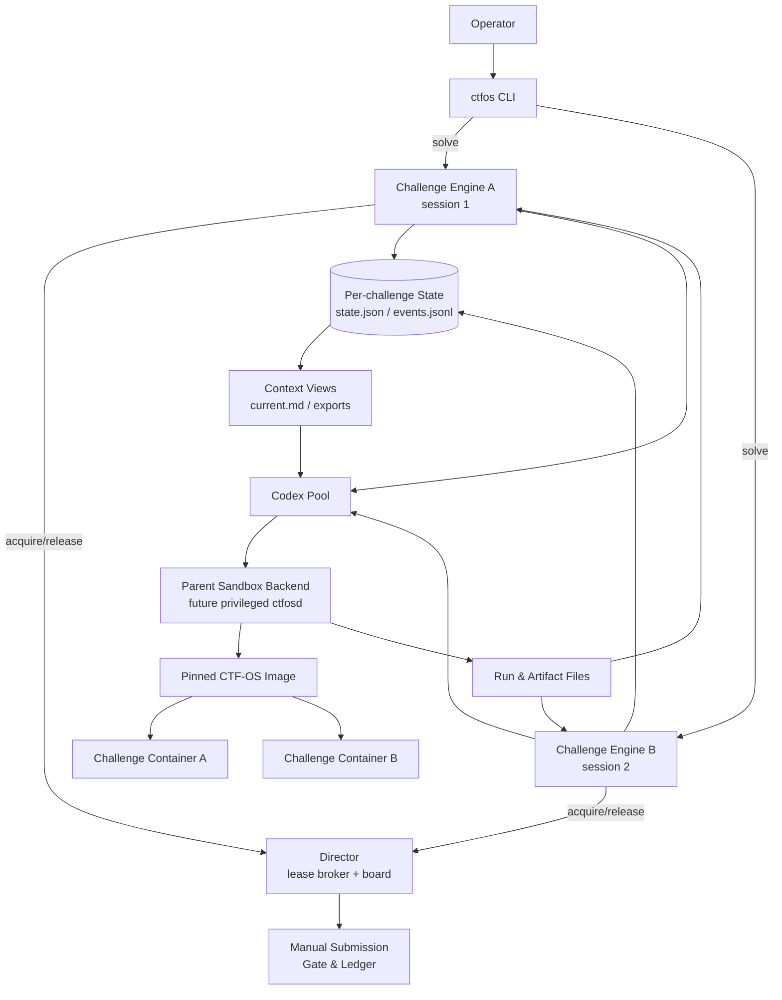
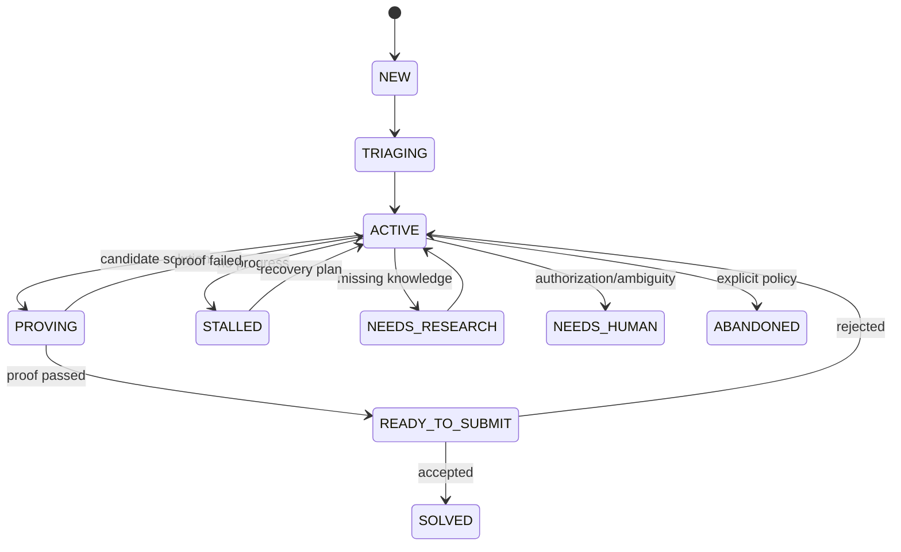

# CTF-OS 구현 설계도

> 상태: 구현 전 설계 기준선  
> 대상: 현재 `CTF-OS` 저장 디렉터리와 `ctf-os-image`  
> 목표: 문제 하나를 최고 성능으로 푸는 엔진. 문제를 더 열고 싶으면 세션을 하나 더 연다.
>
> **현재 구현 정본:** 이 문서는 설계의 근거와 당시의 목표를 보존한다.
> 실제로 구현된 명령, 강제 가능한 보장과 남은 제한은
> [10. 구현 결과](10-implementation-result.md)를 따른다. 아래에서 현재
> 계약과 정면 충돌하던 모델 호출·제출 문구는 구현 결과에 맞게 교정했다.

설계 단위를 먼저 못 박는다. 이 엔진의 단위는 대회가 아니라 **문제 하나**다. `ctfos solve`를 한 번 더 실행하면 같은 엔진 인스턴스가 하나 더 열린다. 두 번째 세션은 축소판이 아니라 첫 번째와 완전히 같은 엔진이고, 같은 역할·같은 반증·같은 증명 절차를 그대로 돈다.

호스트를 공유하므로 최소한의 조정은 필요하다. 다만 그 조정은 "누가 먼저 할지 정하는 스케줄러"가 아니라 **"지금 자원이 있는지 답하는 브로커"**다. 우선순위 큐도, 선점도, 대회 단위 계획도 두지 않는다. 무엇을 언제 열지는 사람이 정한다.

서로 다른 문제의 세션 생성은 대회 스케줄러의 허가를 기다리지 않는다.
**두 번째 세션도 Captain 1 + worker 3이라는 논리적 역할 구성을 온전히
갖는다.** 그러나 이것은 세 worker의 실제 모델 호출이 즉시 동시에
시작된다는 보장이 아니다. Batch 호출은 전역 provider/account 상한의 FIFO
슬롯을 기다릴 수 있다. Live native 호출에는 이 local FIFO를 적용하지
않지만 실제 계정/provider 한도에서 Codex/provider가 호출을 대기시킬 수
있다. 같은 문제에는 상태 안전을 위한 단일 session owner lock이 적용된다.

## 1. 결론

CTF-OS는 “에이전트 10개를 띄우는 시스템”으로 만들면 안 된다. 실제 구현 단위는 다음 네 개면 충분하다.

1. **Challenge Engine**: 문제 하나의 상태 머신과 목표·가설·실험·증명 루프를 관리한다. **이것이 제품이다.** 세션 하나가 인스턴스 하나이고, 나머지 셋은 이 엔진을 여러 번 열 수 있게 해주는 받침대다.
2. **Codex Pool**: configured Sol/Terra/Luna 역할 실행과 구조화된 결과
   수집을 담당한다. 이 이름은 model ID 라우팅이며 실제 계정 E2E 검증을
   뜻하지 않는다.
3. **Sandbox Pool**: 문제별 컨테이너, 도구 실행, 로그, 자원 제한, 깨끗한 재현을 담당한다.
4. **Director**: Batch provider 호출과 도구 자원의 리스를 발급하고, 대회
   보드와 제출 게이트를 제공한다. 이름과 달리 **무엇을 풀지 지시하지
   않는다.** 자원 요청에 예/아니오/잠깐만을 답할 뿐이다. Live 내부 native
   subcall에는 개별 provider lease를 걸 수 없다.

보고서의 Scout, Falsifier, Librarian, Governor, Submitter는 별도 상시 프로세스가 아니라 위 네 컴포넌트가 실행하는 **역할 또는 단계**로 구현한다. Blackboard와 Shared Ledger도 서비스가 아니라 문제별 상태 파일과 모델용 읽기 뷰다.

가장 중요한 구현 원칙은 다음과 같다.

- 문제풀이 주 세션의 설정 기본값은 **Sol Ultra**다. model ID와 effort는
  설정 가능하며 실제 계정 Live TUI E2E는 아직 검증하지 않았다.
- **위임권 배타는 문제 안에서만 성립한다.** 한 문제에서 Ultra의 자동 위임과 Director의 외부 위임을 동시에 돌리지 않는다. 다른 문제의 세션은 이 규칙과 무관하게 자기 턴을 돈다.
- 서로 다른 문제의 세션에는 대회 단위 배타를 두지 않는다. 논리 역할 수는
  문제별로 유지하되, 실제 Batch 모델 호출은 전역 provider/account 상한을
  공유하고 대기할 수 있다.
- **model-call 동시성의 local FIFO hard cap**은 Director가 직접 시작하는
  Batch 프로세스에만 건다. Live Ultra 내부 위임은 max-thread 설정과 역할
  지침을 주며 계정/provider 쪽에서 대기할 수 있지만, CTF-OS가 subcall별
  local FIFO나 완전한 관측을 제공한다고 주장하지 않는다. 이 문장은
  문제별 wall-clock deadline과 별개다. 그 deadline은 Live TUI process
  group에도 적용한다.
- Live/Batch 모두 host shell, `exec_command`/`write_stdin`, web search,
  apps/plugins, tool-suggest, browser/computer-use, image-generation과 user
  MCP를 끈다. Live production surface에 남는 `exec`는 filesystem/network
  없는 V8 orchestration이며 host shell이 아니다.
  Batch는 user config/rules도 무시하고 `agents.enabled=false`와
  `features.multi_agent=false`로 native multi-agent를 이중 차단한다.
  Live는 두 값을 모두 `true`로 고정해 세 native worker 구성을 유지한다.
  이로써 Batch 세 외부 역할 밖의 중첩 위임·비용 확장을 막되 Live 구성을
  꺼뜨리지 않는다.
- 병렬 탐색자는 정본 상태를 직접 수정하지 않는다.
- 문제의 구조화 상태와 상태 전이 정본은 문제별 `state.json`이고, worker는
  실행별 결과 파일만 쓴다.
- Challenge Engine 하나만 상태를 반영하며 임시 파일과 원자적 rename으로 `state.json`을 교체한다.
- Markdown과 `events.jsonl`·model event JSONL은 파생 뷰 또는 감사 자료다.
  대회 전체 accepted 중복 판정에 쓰는 `submissions.jsonl` ledger와
  hash-validated artifact/proof evidence까지 “JSONL 감사 로그일 뿐”이라고
  일반화하지 않는다.
- 문제 파일 실행과 네트워크 접근은 항상 문제별 컨테이너 안에서 수행한다.
- “플래그처럼 보이는 문자열”과 “재현 가능한 풀이”를 별도 상태로 관리한다.
- 세계 1등급의 기준은 모델 이름이 아니라 **관찰 보존, 반증, 중단·복구, 재현율**이다.

## 2. 현재 코드에서 그대로 살릴 것

현재 호스트 CLI는 작지만 경로 안전성의 기초가 있다.

- `init-contest`: 대회/카테고리/문제 디렉터리 생성
- `solve`: 문제 디렉터리에서 Codex 세션 실행
- 경로 구성 요소 검증
- 심볼릭 링크를 이용한 작업공간 이탈 방지

현재 이미지에는 엔진이 필요로 하는 데이터 평면의 상당 부분이 이미 있다.

- `entrypoint.sh`: 읽기 전용 `/challenge`에서 깨끗한 `/work` 생성
- 원본 파일 SHA-256 인벤토리와 provenance 기록
- `ctfwrap`: stream 전체 drain + bounded raw prefix, 실제 tail summary와
  total/stored/truncated/`capture_complete` metadata, 전체 stream의 bounded
  flag-candidate sidecar 반환
- `ctf-bg`: stdin 없는 백그라운드 작업과 타임아웃
- `ctf-jobs`, `ctf-log`, `ctf-kill`: 상태 조회, 제한 로그, 세션 단위 취소
- `ctf-flag`: 제한된 플래그 탐색
- `ghidra-decompile`, `ktext`: 구조화된 전용 도구
- `/tools/manifest.json`: 설치 도구 검색

현재 as-built 기본값에서 `ctfwrap` raw prefix는 stdout/stderr 각각 16 MiB,
실제 tail summary는 각각 4 KiB다. 별도 `flag-candidates.jsonl`은 전체 drain
stream을 rolling scan한 결과를 후보 1,024개, 총 256 KiB 문자, 파일 1 MiB
상한으로 보존한다. Batch model attempt는 JSONL raw 16 MiB, stderr 1 MiB를
보존하고 structured result 2 MiB 초과를 contract invalid로 처리한다. 두
경로 모두 전체 관측량과 저장량, limit과 truncation metadata를 남긴다.
As-built의 `runtime.work_tree_max_bytes`는 명령 전후 `/work` 안정 scan과
개별 copy/canonical artifact 합계 guard다. 실행 중 매 write를 막는
filesystem quota도, challenge tree 전체 quota도 아니다. 누적 `runs/` raw,
contest `submissions.jsonl`과 전체 challenge tree에는 별도 총량 cap,
retention 또는 GC가 없다.

현재 as-built에서는 이 image primitive를 보존하지만, host의 모든
`start_job` 경로는 job lifetime 전체의 resource lease supervisor가 없어서
명시적으로 거부한다. foreground는 one-shot `docker run --rm`으로
감독한다. 아래 “새로 구현하지 않는다”는 말은 별도 job 시스템을 중복
작성하지 않는다는 설계 원칙이지 background orchestration이 완료됐다는
뜻이 아니다.

따라서 다음 기능은 새로 구현하지 않는다.

- 또 다른 범용 백그라운드 잡 시스템
- 또 다른 로그 tail 구현
- 컨테이너 내부 도구 카탈로그
- 원본 복사와 해시 기록 로직

호스트 엔진은 이 기능을 호출하고 결과를 문제 상태 파일에 등록하는 역할만 맡는다.

## 3. 보고서 설계에서 수정할 부분

### 3.1 초기 버전은 데이터베이스 없이 파일시스템만 사용한다

[엔진 청사진](06-engine-blueprint.md)은 `facts.jsonl`, `hypotheses.jsonl`, `experiments.jsonl`을 제안한다. 네 개의 모델 슬롯과 여러 도구 작업이 동시에 끝나는 환경에서는 다음 문제가 생긴다.

- 동시 append 순서가 비결정적이다.
- 여러 파일 사이의 원자적 갱신이 불가능하다.
- 부분 쓰기 후 프로세스가 죽으면 복구가 어렵다.
- 가설, 근거, 실험, artifact 사이의 참조 무결성을 보장하기 어렵다.
- 재개 시 어느 상태가 마지막으로 확정됐는지 판단하기 어렵다.

시간이 제한된 초기 버전에서는 이 문제를 데이터베이스로 해결하지 않는다. 쓰기 구조를 다음처럼 제한한다.

- 각 worker는 고유한 `runs/<run-id>/result.json`만 생성하고 공유 상태를 수정하지 않는다.
- Challenge Engine만 worker 결과를 순서대로 검증하고 문제별 `state.json`에 반영한다.
- `state.json`은 `schema_version`과 증가하는 `revision`을 가진다.
- 갱신은 같은 디렉터리에 임시 파일을 쓰고 `fsync`한 뒤 `os.replace`로 교체한다.
- 문제별 `.lock`에 `flock`을 걸어 두 개의 엔진이 같은 문제를 동시에 갱신하지 못하게 한다.
- `events.jsonl`은 디버깅과 감사용이다. 복구 기준은 항상 마지막으로 온전하게 읽히는 `state.json`이다.

CTF 한 대회에서 다루는 상태량은 작은 JSON 파일로 충분하다. 실제 사용에서 파일 크기나 조회 성능이 문제가 된 뒤에만 데이터베이스 도입을 다시 검토한다.

### 3.2 보고서의 10개 컴포넌트를 4개 런타임으로 합친다

역할마다 daemon이나 microservice를 만들면 IPC, 장애 복구, 상태 중복이 먼저 커진다. 역할은 다음처럼 매핑한다.

| 보고서 개념 | 실제 구현 |
|---|---|
| Intake, Scout | Challenge Engine의 stage |
| Scheduler | 없음. 사람이 세션을 열고 브로커가 자원만 중재한다 |
| Runner, Governor | Challenge Engine |
| Blackboard, Shared Ledger | 문제별 `state.json` + 생성된 context view |
| Falsifier, Librarian | Codex Pool의 role |
| Submitter | Director의 사람 제출 gate와 감사 ledger. 외부 전송 없음 |
| Container Tool Sandbox | Sandbox Pool |

### 3.3 Hooks는 보조 안전장치로만 사용한다

Hook은 위험 명령 차단, 실행 감사, 특정 wrapper 사용 강제에 쓴다. 다음 핵심 의미론은 Hook에 넣지 않는다.

- 사실의 provenance 검증
- 가설 상태 전이
- 실험의 사전 등록
- 증명 통과 여부
- 제출 가능 여부

이 규칙은 구조화 출력 스키마, 단일 writer, 원자적 파일 교체, 상태 머신이 강제해야 한다.

### 3.4 모든 문제에 “깨끗한 실행 3회”를 기계적으로 적용하지 않는다

기본 정책은 3회 재현이지만 카테고리에 따라 증명 정책을 바꾼다.

- 결정적 offline 풀이: 깨끗한 원본에서 기본 3/3
- race exploit: 정해진 횟수에서 성공률과 실패 분포 기록
- 원격 Web: rate limit을 지키며 독립 세션에서 재검증
- Forensics: 원본 hash, 추출 경로, 결과 hash를 중심으로 검증
- 대회 서버가 불안정한 경우: local proof와 remote proof를 분리

## 4. 전체 아키텍처



### 4.1 신뢰 경계

시스템을 두 영역으로 나눈다.

**Control plane**

- Director
- Challenge Engine
- 문제별 JSON 상태 파일과 파일 writer
- Codex 결과 검증기
- 제출 게이트

**Untrusted data plane**

- 문제 원본
- 문제 바이너리/스크립트
- 브라우저가 방문하는 대상
- 디컴파일러, fuzzing, exploit 실행
- 다운로드된 문서와 artifact

Control plane은 문제 바이너리를 직접 실행하지 않는다. 모든 실행은 Sandbox Pool을 거친다.

### 4.2 Sandbox Pool과 Attached Live broker

설계 목표는 별도 권한의 작은 `ctfosd`가 Docker 권한을 독점하는 것이다.
현재 as-built에서 `ctfos solve` 부모는 `session.lock`, canonical state와
Docker sandbox를 소유한다. Live Codex의 host shell은
`features.shell_tool=false`이고, 사용자 MCP는 `mcp_servers={}`로 먼저
지운다. 그 뒤 현재 CTF-OS Python의 검증된 절대 경로와
`-I -m ctf_os.live_mcp`로 실행하는 required local stdio MCP
`ctfos_live` 하나만 등록한다. Live의 유일한 state/challenge-execution
MCP는 다음 열네 canonical operation뿐이다. 열네 개는 Codex built-in
도구까지 합한 전체 tool 수가 아니다.

- `agent.flag`, `agent.fact`, `agent.goal`, `agent.hypothesis`
- `agent.experiment`, `agent.evaluate`, `agent.artifact`
- `agent.progress`, `agent.transition`
- `tool.run`, `jobs`, `inspect`
- `knowledge.search`, `knowledge.read`

Codex 0.145의 production-model mock Responses request 캡처에서는 external
app/web/network, `request_plugin_install`,
`exec_command`/`write_stdin`/shell tool이 0개였다. 별도로 남는 built-in은
`exec`, `wait`, `apply_patch`, native collaboration, `tool_search`,
`view_image`, plan/user-input과 generic MCP resource helper다. `exec`는
filesystem/network가 없는 V8 orchestration이고 `apply_patch`는 challenge
workspace writer이므로 host shell이나 state/Docker 직접 권한과 같지 않다.
`tool_search`는 이 구성에서 `ctfos_live`만 안내하며 app surface를 되살리지
않는다. `ctfos_live`는 MCP resources를 구현하지 않으므로 generic resource
list/read는 실패한다.
`view_image`는 외부 app/web/network egress나 command 실행 경로는 아니지만,
legacy `workspace-write` filesystem sandbox에서 추측 가능한 workspace 밖
host image path를 model input에 올릴 수 있다. 현재 user config의
`sandbox_mode`가 custom permission profile을 무시하게 만들며 interactive에는
`--ignore-user-config`나 unset 방법이 없다. 이는 MEDIUM challenge-scope 잔여
위험이다. 대회 전 민감 이미지 정리·이동이 운영 완화책이고, 별도
`CODEX_HOME` 또는 user `sandbox_mode` 제거 후 custom profile 적용은 future
hardening이다.

`agent.transition`은 proof·submission 상태를 만들 수 없고, challenge 실행은
`tool.run`을 통해 문제별 sandbox에서만 일어난다. Required MCP의 scope
환경이 없거나 startup이 실패하면 Live가 명시적으로 실패한다. Model-visible
local engine, host shell 또는 실행 fallback은 없다.

부모는 문제별 canonical runtime 아래 `live-mailboxes/session-*`에 mode
`0700`의 session filesystem mailbox를 만들지만 그 path나 capability를 model
argv, prompt, shell environment 또는 `--add-dir`로 전달하지 않는다. 정확한
session marker, mailbox path와 scope capability는 Codex가 required MCP
subprocess에만 전달하는 explicit `env_vars`다. MCP는 함께 받은 challenge
identity를 요청마다 고정하고 request-ID 파일로 부모에 요청한다.

부모는 scope, identity, capability와 operation allowlist를 검증하고 state/tool
operation을 직렬화한다. Request/response는 각각 최대 1 MiB이고, private
temporary file write + file/directory `fsync` + same-dirfd `replace`로
publish한다. Parent/client는 dirfd anchor, `O_NOFOLLOW`, regular file, owner,
link count 1과 읽기 전후 stable size/mtime을 검사한다. Command network는
꺼져 있다.

수락한 request ID는 세션 안에서 최대 16,384개까지 보존해 같은 ID의
mutating operation을 at-most-once dispatch한다. 각 string-array parameter는
4,096 item, item당 64 KiB, 합계 512 KiB이고 operation timeout은 최대
28,800초, client wait grace는 최대 180초다. 개별 malformed/hostile
request나 response entry 오류는 가능한 한 그 request의 bounded error
channel로 격리해 watcher를 유지한다. Mailbox entry가 4,096개를 넘거나
request failure를 안전하게 게시할 수 없으면 server status를 terminal
error로 바꾸고 client가 명시적으로 실패하므로 silent starvation으로
진행하지 않는다.

종료 때 active operation을 join한 뒤 session lock을 놓는다.
Mailbox는 최대 scan 수만 재귀 없이 정리하고, model이 만든 하위 디렉터리나
잔여 entry가 있으면 private leaf를 강제 삭제하지 않는다. 제출, proof,
예산 reset과 target 변경은 사람의 별도 터미널에서 실행한다. Persistent
background start/log/kill은 lifetime lease supervisor가 없어 Live MCP
surface에 노출하지 않는다.

따라서 Live model과 MCP bridge가 Docker socket이나 canonical state를 직접
소유하지 않는 경계는 구현됐다. 다만 부모 sandbox backend는
`LocalChallengeSandboxClient`이고, persistent `ctfosd` lifecycle과 별도 Unix
principal에 의한 OS 권한 분리는 아직 설계 목표다.

회귀 테스트는 격리 stdio MCP process가 실제 mailbox broker를 거쳐
`agent.flag`를 호출하고 부모가 후보를 즉시 출력·영속하는 경로와 exact
runtime mailbox cleanup을 검증한다. 이는 typed MCP transport와 parent
dispatch의 증거지만 실제 계정의 Sol interactive TUI 전체와 native 세
worker 병렬 E2E 증거는 아니다.

Live scope capability TTL은 남은 문제 deadline과 8시간 중 짧은 값이다.
기본 Live runner도 발급 시점에 고정한 monotonic `D`로 전체 process group을
감독한다. `budget-reset`은 이후 발급되는 작업의 state deadline을 정하지만
이미 발급된 Live/Batch/tool/proof의 `D`나 capability를 연장하지도,
단축·취소하지도 않는다. 새 경계를 즉시 적용하려면 사람이 기존 작업을
중단해야 한다. Live를 계속하려면 세션을 닫고 `ctfos solve ...
--resume-thread THREAD_ID`로 새 `D`와 capability를 발급받는다.

## 5. 운용 모드와 자원 리스

### 5.1 Live Operator Mode

사람이 대회 중 주로 사용하는 모드다.

```text
ctfos solve <contest> <category> <challenge> [prompt]
```

- configured Captain model/effort가 세션을 이끈다. 기본값은 Sol Ultra다.
- Engine은 canonical state·adapter·지식으로 Live workspace의 `SESSION.md`를
  생성한다. Captain의 직접 입력은 이 `SESSION.md`이며, host의
  `context/current.md`는 같은 state에서 만든 별도 파생 뷰이지 Captain이
  직접 여는 경로가 아니다.
- Codex native subagent가 Recon/Specialist/Falsifier 세 논리 역할을
  수행한다.
- `agents.enabled=true`와 `features.multi_agent=true`를 함께 고정해 이 세
  native worker 구성을 활성 상태로 보존한다. 실제 시작 시점은
  account/provider 대기의 영향을 받을 수 있다.
- Captain은 required `ctfos_live` MCP의 typed tool로 사실, 실험, artifact를
  제안하고, plausible flag는 즉시 `agent.flag`로 기록한다. 단순 terminal
  출력만 하거나 자동 제출하지 않는다.
- Challenge Engine이 제안을 검증해 `state.json`에 순서대로 반영한다.

이 모드에서는 **이 문제에 한해 Codex native delegation이 유일한 위임 소유자**다. 엔진은 같은 문제에 별도 `codex exec` worker를 동시에 띄우지 않는다.

이 명령은 몇 번이든 실행할 수 있다. 문제마다 독립된 엔진 인스턴스가 열리고, 서로의 상태를 보지 않으며, 공유하는 것은 5.4의 자원 리스뿐이다.

같은 문제로 두 번 실행하면 `runtime/session.lock`을 이미 잡은 owner가 있으므로
두 번째 실행은 새 동시 세션을 만들지 않고 현재 owner 정보를 표시하며
종료한다. 이전 Live 실행이 끝난 뒤에는 `--resume-thread <thread-id>`로
명시한 Codex thread를 재개할 수 있다. CTF-OS가 실행 중인 TUI에 자동으로
붙거나 thread ID를 추측하지는 않는다. 정본은 `state.json`이고 writer와
session owner는 서로 다른 lock으로 직렬화된다.

`solve`, `run-challenge`, 직접 `update_prompt`와 기존 문제의
`add-challenge --prompt`가 받은 새 prompt는 `runtime/session.lock` 획득
뒤에만 commit한다. 경쟁 호출이 owner lock을 얻지 못하면 기존 prompt,
revision과 canonical bytes는 바뀌지 않는다. 이 보장은 prompt 경로에
한정하며 target·knowledge·budget 등 모든 operator configuration mutation을
포괄하지 않는다.

### 5.2 Deterministic Batch Mode

회귀 평가와 야간 재실행에 사용한다. 대회를 자동으로 운용하는 모드가 아니다. 대회 중에는 사람이 5.1을 필요한 만큼 실행한다.

```text
ctfos run-challenge <contest> <category> <challenge>
```

순서는 다음과 같다.

1. configured Captain(기본 Sol Ultra)이 다음 wave와 성공/중단 기준을
   결정한다.
2. Captain 호출이 끝난 뒤 그 wave의 논리 역할 세 개를 모두 유지한다. 실제
   worker 호출은 전역 provider/account 상한의 FIFO 슬롯을 얻는 순서대로
   시작하므로 다른 세션 때문에 대기할 수 있지만 wave를 좁히지는 않는다.
3. worker별 `result.json`을 schema 검증하고 `state.json`에 순서대로 반영한다.
4. 같은 configured Captain이 통합하고 다음 상태를 결정한다.

**이 문제 안에서** Captain 호출과 외부 worker wave를 겹치지 않는다. 다른
문제의 세션은 이 규칙에 묶이지 않는다. Batch role prompt는 추가 native
delegation을 금지하고 command start/resume는 user config/rules를 무시하며
`agents.enabled=false`와 `features.multi_agent=false`를 함께 적용한다.
Director가 시작한 세 외부 `codex exec` 역할만 provider FIFO로 세므로
worker 내부의 중첩 delegation과 그 비용 확장을 막는다. Live 내부 native
subcall은 같은 방식으로 하드 강제할 수 없고 실제 account/provider가
대기시킬 수 있다. 리스 방식은 5.4, 회계 방식은 Phase 4를 따른다.

### 5.3 상태 lock, session lock과 진단 marker

잠금은 **문제 단위**다. 대회 단위 배타 lock은 두지 않는다. 대회 lock을 잡으면 두 번째 세션이 열리지 못하고, 그 순간 "세션은 자유롭게 연다"는 전제가 깨진다.

세 lock/marker의 역할을 분리한다.

```text
challenges/<category>/<challenge-id>/.lock
  짧은 state CAS·previous 복구 mutex

challenges/<category>/<challenge-id>/runtime/session.lock
  같은 문제의 Live/Batch/tool/proof owner 수명 배제

challenges/<category>/<challenge-id>/runtime/delegation-owner.json
  Live native owner의 pid/시각을 남기는 진단 marker
```

`.lock`과 `session.lock`의 `flock`은 운영체제가 owner process 종료 시
해제한다. `delegation-owner.json` 자체는 lock, lease나 권한 정본이 아니며
stale해도 새 session의 `session.lock` 획득을 막지 않는다.

### 5.4 자원 리스

서로 다른 문제의 세션을 여는 데에는 대회 단위 스케줄러 허가가 필요 없다.
다만 같은 문제의 session owner lock, Codex 실행 실패 같은 정상적인 오류까지
“언제나 즉시 성공”으로 보장하지는 않는다.

**논리적 역할 수는 문제 단위 규정이다.** 각 세션은 자기 문제에 대해
Captain 1 + worker 3을 온전히 갖는다. 세션이 둘이면 논리 worker 역할은
3+3이고, 셋이면 3+3+3이다. 두 번째 세션이 축소판이 아니라는 말은 역할을
삭제하거나 wave 폭을 줄이지 않는다는 뜻이다.

반면 **실제 Batch provider 호출은 전역 account 상한을 공유한다.** 호출을
먼저 논리적으로 생성한 뒤 FIFO 슬롯이 날 때까지 기다린다. 즉 “즉시 세션
생성”과 “즉시 worker 3개 동시 호출”은 같은 보장이 아니다. Live 내부 native
subcall은 Codex 프로세스 안에서 생성되므로 CTF-OS가 호출별 전역 lease를
강제할 수 없지만, 계정/provider 상한에서는 Codex/provider가 호출을
대기시킬 수 있다.

### 5.4.1 브로커가 실제로 중재하는 것

브로커는 호스트 도구 자원과 CTF-OS가 직접 실행하는 Batch provider 호출을
중재한다. 모델 역할 목록 자체를 리스 수에 맞춰 잘라내지는 않는다.

| 종류 | 단위 | 예산 | 브로커가 하는 일 |
|---|---|---:|---|
| logical captain | **문제별** | 1 | 역할과 문제 내 순서를 유지한다 |
| logical worker | **문제별** | 3 | 세 역할을 유지하고 wave를 좁히지 않는다 |
| Batch provider call | 전역 | 설정값, 기본 4 | cross-process FIFO 대기와 사망 holder 회수 |
| Live native subcall | Codex 세션 내부 | 설정상 최대 thread 4 | CTF-OS local FIFO 없음. 역할 지시와 설정을 유지하고 계정/provider 대기는 허용 |
| tool | 전역 | 자원 등급표 (7.3) | CPU·RAM 예약. 초과분은 큐 |
| gpu | 전역 | 1 | 배타 점유. VRAM 8 GiB라 분할하지 않는다 |
| remote command start | 대상 hostname별 | 기본 1초 | cross-process FIFO로 tool/proof command의 실제 시작 간격을 벌림 |
| remote HTTP request | 팀/IP·대상 정책 | 대회 정책 | 한 command 내부 요청은 외부 restricted proxy/firewall가 강제 |

브로커 API는 세 개다. 이보다 늘리면 계약이 커진 것이므로 되돌린다.

```text
acquire(request, timeout, allow_partial=false) -> lease | none
release(lease)
status() -> 현재 리스 목록
```

complete resource bundle은 원자적으로 발급하거나 기다린다. 부분 발급은
단일 resource kind를 명시적으로 요청한 경우에만 opt-in할 수 있고, model
wave의 역할 수를 줄이는 데 사용하지 않는다. 발급 순서는 선착순이고
우선순위 계산은 하지 않는다. 현재 구현은 PID와 process start ticks로 죽은
holder를 회수한다.

### 5.4.2 불변식

```text
문제 단위 (하드)
  session.lock으로 같은 문제의 Live/Batch/tool/proof owner는 겹치지 않는다.
  Batch 제어 흐름으로 그 문제의 Captain 턴과 worker wave는 겹치지 않는다.
  한 문제가 동시에 쓰는 worker는 worker_slots_per_challenge 이하다.

전역 (하드, 브로커가 강제)
  CTF-OS가 직접 실행하는 Batch provider call 수가 설정 상한을 넘지 않는다.
  실행 중 tool job의 CPU·RAM 합이 예산을 넘지 않는다.
  GPU job은 한 번에 하나다.

전역 (현재 하드 강제 불가)
  Live 내부 native subcall 각각의 provider 시작 시점.
  대상 호스트별 HTTP 요청 속도.
```

서로 다른 문제의 **논리 세션에는 전역 배타가 없다.** 그러나 세션 A와 B의
Batch 호출은 같은 provider FIFO 상한을 공유하므로 실제 모델 호출 시작은
서로 기다릴 수 있다. Live 내부 호출에는 같은 수준의 하드 강제를
주장하지 않는다.

### 5.4.3 모델 대기의 경계

Batch는 CTF-OS가 각 `codex exec`를 시작하므로 전역
`provider_max_concurrent_calls`를 하드 강제할 수 있다. 상한이 차면 역할을
삭제하지 않고 그 호출만 FIFO로 기다린다.

Live는 Ultra의 내부 native delegation을 CTF-OS 프로세스가 호출별로 감싸지
못한다. 따라서 Live에는 논리 역할과 max-thread 설정을 전달하고 실제
호출은 계정/provider 한도에서 기다릴 수 있지만, 개별 subcall에 CTF-OS의
local FIFO가 적용된다고 보장하지 않는다. “세션을 사람이 바로 요청할 수
있다”와 “세 native worker가 즉시 동시에 시작된다”는 서로 다른 계약이다.
상태 정합성과 도구 안전은 별도의 문제별 lock과 tool resource broker가
지킨다.

### 5.4.4 세션이 서로에게 실제로 미치는 영향

실제 간섭 경로는 다음과 같다.

| 경로 | 증상 | 세션이 받는 영향 |
|---|---|---|
| Batch provider 상한 | 모델 호출이 FIFO에 걸린다 | 역할 폭은 그대로이고 시작만 늦어진다 |
| tool 예산 | Ghidra·Volatility 같은 heavy job이 큐에 걸린다 | 도구 결과가 늦게 온다. 엔진 폭은 그대로 |
| GPU | GPU job이 순서를 기다린다 | 위와 같음 |
| remote command start | hostname FIFO에서 기다린다 | 실제 command 시작은 설정 간격을 유지. HTTP 요청 수는 별도 |
| remote HTTP rate | 외부 proxy와 운영 정책이 관리한다 | command 내부 여러 요청은 CTF-OS가 세지 못함 |

**세션을 늘려도 논리 역할 폭은 줄지 않는다.** 줄어들 수 있는 것은 Batch
모델 호출과 도구 결과가 시작·도착하는 속도다.

## 6. 모델과 추론 강도

토큰 절약보다 풀이 품질을 우선한다.

아래 표는 설정 기본 라우팅이다. as-built는 model ID와 effort를 설정에서
바꿀 수 있으며, local test는 argv와 역할 계약을 검증한다. Stdio MCP
transport와 실제 parent broker dispatch는 local integration test로
검증했지만, 실제 계정에서 Sol/Terra/Luna를 모두 호출한 solve나 Sol
TUI/native 세 worker E2E 증거는 아니다.

| 역할 | 모델 | 추론 강도 | 쓰기 권한 | 목적 |
|---|---|---:|---|---|
| Captain | Sol | ultra | 상태 결정 제안 | 해석, 경로 선택, 통합 |
| Recon | Terra | max | 없음 | 공격 표면, 보호기법, 관찰 |
| Specialist | Terra | max | 없음 | 카테고리 분석, PoC 후보 |
| Builder | Sol | max | 단일 workspace writer | exploit/solver 구현 |
| Falsifier | Sol | max | 없음 | 독립 반증, 대안 가설 |
| Extractor | Luna | max | 없음 | 대량 출력과 artifact 구조화 |
| Reproducer | Terra | max | proof workspace만 | 깨끗한 재현 |

운영 규칙:

- 기본 라우팅에서 Ultra는 Captain에만 둔다. 문제마다 Captain은 하나이고,
  문제가 여럿이면 Captain도 여럿이다.
- Batch worker의 기본 effort는 max이고 추가 native 위임을 금지한다. 따라서
  Director가 시작한 Batch worker에 한해 리스 수와 프로세스 수를 맞춰
  강제할 수 있다.
- 서로 다른 문제의 Captain과 worker 역할은 독립적으로 존재한다. Batch의
  실제 provider 호출은 전역 상한에서 대기할 수 있지만 역할을 나눠 받거나
  삭제하지 않는다.
- 동시에 같은 exploit 파일을 수정하는 worker는 한 명뿐이다.
- Falsifier는 Builder의 대화 history를 받지 않는다.
- Luna는 결정을 내리지 않고 대량 결과를 정리한다.
- Terra 결과가 막히거나 공격 경로가 고난도면 Sol max로 승격한다.
- 모델 라우팅은 비용 절약이 아니라 작업 형태와 독립성 확보를 위한 것이다.

## 7. 로컬 자원과의 결합

현재 확인한 시스템 기준선:

- CPU: Ryzen 5 7500F, 6 core / 12 thread
- RAM: 약 27 GiB
- Swap: 16 GiB
- GPU: RTX 4060 Ti, 8 GiB VRAM
- 실행 환경: WSL2 + Docker
- 디스크: 약 912 GiB 여유
- Batch provider 호출 상한: 기본 4

### 7.1 자원은 세 종류로 따로 계산한다

1. **Model slots**: Captain/subagent/`codex exec` 동시 수
2. **Tool resources**: CPU, RAM, GPU, PID, I/O
3. **Remote budget**: 요청 수, rate limit, 제출 횟수

모델 작업이 끝나도 Ghidra나 fuzzing job은 계속 실행될 수 있으므로 model slot과 실행 중 tool 자원 예약을 묶어 계산하면 안 된다.

이 분리가 곧 "여러 문제를 동시에 다룬다"는 말의 실제 내용이다. 층마다 동시성의 성격이 다르다.

| 층 | 세션 간 동시성 | 상한 | 실제 의미 |
|---|---|---|---|
| 세션 자체 | 문제별 독립 | 대회 스케줄러 없음 | 다른 문제는 열고 싶을 때 연다. 같은 문제는 owner lock 하나 |
| Ultra Captain 역할 | 문제마다 1 | 문제마다 1 | Live 내부 호출별 전역 lease는 강제하지 못한다 |
| Worker 역할 | 문제별 3 | **세션마다 3** | 세션 둘이면 논리 역할은 6. Batch 실제 호출은 전역 provider 상한에서 대기 |
| Tool job | 있음. 예산 내 완전 병렬 | 자원 등급표 | 문제 A의 Ghidra가 도는 동안 문제 B가 wave를 돈다 |
| Remote command start | 대상 hostname별 공유 | 기본 1초 | tool/proof command 시작을 FIFO로 간격화 |
| Remote HTTP budget | 팀/IP·대상별 공유 | 대회 정책 | 외부 restricted proxy와 사람이 관리 |
| 진행 상태 | 전부 동시 | 없음 | 상태가 파일에 있으므로 열어둔 문제 수만큼 ACTIVE를 유지한다 |

두 가지를 덧붙인다.

첫째, 가장 큰 실효 병렬성은 모델 층이 아니라 **tool 층**에서 나온다. 디컴파일, 메모리 덤프 분석, 브루트포스는 수십 분 단위이고 그동안 모델 슬롯을 전혀 점유하지 않는다. 두 번째 세션을 열고 싶어지는 순간이 대체로 첫 세션이 tool을 기다리는 순간과 겹치는 이유이고, 그때는 자원 경합이 거의 없다.

둘째, remote budget만은 문제별로 나누면 안 된다. 대회 서버의 rate limit은
문제가 아니라 팀이나 IP 단위로 걸릴 수 있다. 문제마다 독립 예산을 주면
세션을 두 개 여는 순간 조용히 한도를 넘는다. 현재 코드는 대상 hostname별
tool/proof **command 시작**만 공용 FIFO에서 기본 1초 간격으로 벌린다. 한
command가 보내는 여러 HTTP 요청은 세지 못하므로 실제 요청 속도와 횟수는
외부 restricted proxy와 사람이 대회 정책보다 보수적으로 관리한다.

**제한 대상은 요청이지 세션 생성이 아니다.** 같은 호스트를 쓰는 Web
문제를 더 여는 행위 자체를 스케줄러가 막지는 않는다. command-start
spacing을 HTTP request token bucket으로 읽어서는 안 된다.

### 7.2 초기 안전 예산

호스트와 WSL을 위해 4 logical CPU와 8 GiB RAM을 남긴다.

```toml
[resources]
worker_slots_per_challenge = 3   # 고정 논리 폭. provider 상한은 호출만 기다리게 한다
wave_width_discovery = 3
wave_width_attack = 3
wave_width_proof = 3
provider_max_concurrent_calls = 4
provider_wait_timeout_s = 900
lease_wait_timeout_s = 300
tool_cpu_budget = 8
tool_memory_gib = 18
max_standard_jobs = 2
max_gpu_jobs = 1
```

대회 전 `ctfos doctor --calibrate`는 실제 WSL/Docker limit을 읽고 보수적인
권장값을 출력할 뿐 설정을 자동 변경하지 않는다. 운영자가 확인한 뒤
`engine.toml`을 조정한다.

### 7.3 작업 등급

| 등급 | CPU | RAM | 동시성 | 예 |
|---|---:|---:|---:|---|
| light | 1 | 2 GiB | 최대 3 | strings, checksec, metadata |
| standard | 2 | 4 GiB | 최대 2 | GDB, browser, 일반 solver |
| heavy | 4 | 8 GiB | 최대 2개가 아니라 총 예산 내 1~2 | Ghidra, Volatility, Sage |
| gpu | 4 | 10 GiB host + GPU 독점 | 1 | GPU cracking/ML 도구 |

GPU는 VRAM 8 GiB라서 분할하지 않는다. GPU 작업 하나가 끝나기 전에는 다음 GPU 작업을 큐에 둔다.

### 7.4 대회 중 이미지 정책

- 이미지 build는 대회 hot path에서 실행하지 않는다.
- 대회 시작 전 `ctfos pin-image`로 exact local image ID를 고정하는 것이
  권장 설계다. 현재 설정에서는 digest가 선택값이며 `doctor`가 미고정을
  경고한다.
- digest가 설정돼 있으면 일반 tool, workspace 초기화와 clean proof의
  effective Docker 실행 reference로 사용하고 run/proof 환경에도 기록한다.
- 도구가 없으면 즉시 image rebuild를 시작하지 않고 challenge-local artifact 또는 승인된 fallback을 사용한다.
- proof는 분석 컨테이너를 재사용하지 않고 같은 고정 digest의 새 컨테이너를 사용한다.

## 8. 상태 저장 설계

### 8.1 디렉터리

```text
.ctfos/
  engine.toml
  contests/
    <contest-id>/
      contest.json
      board.md
      runtime/
        leases.json
        leases.lock
      challenges/
        <category>/
          <challenge-id>/
            state.json
            state.prev.json
            events.jsonl
            .lock
            runtime/
              session.lock
              delegation-owner.json
            context/
              current.md
              history/
            runs/
              <run-id>/
                request.json
                result.json
                validation.json
                raw/
            artifacts/
            knowledge/
            proof/
            exports/
```

대회 디렉터리에 배타 session lock은 없다. `leases.lock`은 리스 표를
갱신하는 동안만 짧게 잡는 mutex이지 세션을 배제하는 lock이 아니다. 문제
루트 `.lock`도 state CAS·복구 동안만 잡는다. 같은 문제의 Live/Batch/tool/
proof 수명 배제는 `runtime/session.lock`이 담당한다.

문제 원본은 계속 다음 위치에 둔다.

```text
incoming/<contest>/<category>/<challenge>/
```

원본은 읽기 전용 mount하고, 분석 workspace와 proof workspace는 별도로 만든다.

### 8.2 핵심 파일

| 파일 | 역할 |
|---|---|
| `contest.json` | 대회 URL, 시간, 제출 정책 |
| `challenges/<category>/<id>/state.json` | 문제 메타데이터, 상태, 목표, 사실, 가설, 실험, 진행 표식, 예산, 제출 후보와 run/artifact 참조 |
| `challenges/<category>/<id>/state.prev.json` | 마지막 상태 교체 전 백업 |
| `submissions.jsonl` | 사람이 기록한 제출 결과와 accepted flag의 대회 전체 중복 판정 ledger |
| `runs/<run-id>/request.json` | 실행 입력, 모델, effort, context hash |
| `runs/<run-id>/result.json` | worker 또는 도구의 구조화된 제안 |
| `runs/<run-id>/validation.json` | 검증 성공 여부와 오류 |
| `runs/<run-id>/raw/` | 원본 stdout, stderr, trace |
| `artifacts/` | solver, exploit, 추출물 등 실제 파일 |
| `challenges/<category>/<id>/events.jsonl` | 문제별 append-only 감사와 디버깅 기록 |
| `board.md`, `context/current.md`, `exports/` | 상태에서 다시 만들 수 있는 파생 뷰 |

`state.json`에는 최소 `schema_version`, `revision`, `updated_at`을 둔다.
사실, 가설, 실험, artifact는 문자열 ID로 서로 참조하며, Challenge Engine이
파일을 교체하기 전에 참조와 상태 전이를 검증한다. As-built는 canonical
state JSON의 안정된 regular-file 읽기와 쓰기를 16 MiB로 제한하고, 최상위
typed collection과 알려진 nested repeated-ID field를 각각 16,384개로
제한한다. 또한 state가 참조하는 canonical artifact의 실제 file-size
합계를 모든 commit에서 `runtime.work_tree_max_bytes`와 대조한다.

이때 `state.json`은 문제의 구조화 상태/전이 정본이다. Hash가 등록된
artifact·proof bytes는 전이 판단의 evidence이며, contest
`submissions.jsonl`은 대회 전체 ledger다. 둘을 state에서 언제든 재생성되는
파생 뷰로 취급하지 않는다. 문서의 “immutable snapshot”은 mode `0400`과
size/SHA-256 재검증으로 변조를 탐지하는 engine-managed, tamper-evident
보관을 뜻한다. 같은 Unix UID의 변경까지 금지하는 `chattr +i`, fs-verity나
별도 OS principal 보장은 아니다.

상태 갱신 순서는 다음으로 고정한다.

1. 문제 `.lock` 획득
2. 현재 `state.json`과 `revision` 확인
3. worker 제안과 artifact 경로/hash 검증
4. 기존 상태를 `state.prev.json`으로 보존
5. 임시 파일을 flush와 `fsync`한 뒤 `os.replace`로 `state.json` 교체
6. 감사 이벤트 append와 Markdown 뷰 갱신
7. lock 해제

`events.jsonl` 감사 로그와 Markdown 갱신이 실패해도 정본 상태를 되돌리지
않는다. 다음 `ctfos status` 또는 `ctfos export`에서 `state.json`을 기준으로
다시 생성한다. 이 문장은 별도 transaction/reconciliation과 중복 accepted
검사에 쓰는 `submissions.jsonl` ledger에는 적용하지 않는다.

### 8.3 사실 provenance

수치 confidence 하나로 provenance를 덮지 않는다.

```text
executed       직접 실행으로 관찰
tool_inferred  도구가 해석하거나 추론
model_claimed  모델이 제안했지만 아직 실행 검증 전
external_doc   원문 문서에 근거
operator       사람이 입력
```

각 사실은 최소 다음 필드를 가진다.

```text
id, challenge_id, statement, provenance, source_run_id,
artifact_id, locator, created_at, supersedes_id
```

`model_claimed` 사실만으로 가설을 `confirmed`로 바꿀 수 없다.

### 8.4 Codex는 상태 파일을 직접 수정하지 않는다

각 stage는 `--output-schema`에 맞는 JSON 결과를 자신의 run 디렉터리에 낸다. 호스트가 다음을 검사한 뒤 상태에 반영한다.

- schema version
- challenge/run ID
- artifact 경로가 허용된 workspace 내부인지
- artifact hash가 실제 파일과 일치하는지
- 사실 provenance가 source와 맞는지
- 가설 전이가 허용되는지
- 읽었던 `revision`이 현재 상태와 일치하는지
- 현재 프로세스가 문제 `.lock`을 보유하는지

유효하지 않은 결과는 `state.json`을 바꾸지 않고 해당 run의 `validation.json`에 남긴다.

## 9. Context Pack

긴 전체 로그를 매번 모델에 넣지 않는다. 그렇다고 추상 요약만 주지도 않는다.

각 호출 전 Challenge Engine이 다음 묶음을 만든다.

```text
1. 문제 설명과 원본 hash
2. 현재 상태와 단일 활성 목표
3. 확정 사실과 provenance
4. 열린 가설, 반증 조건, 최근 변화
5. 마지막 실험의 결과
6. 관련 artifact와 raw log 포인터
7. 카테고리별 primitive/dependency 상태
8. 남은 자원과 명시적 중단 기준
9. 필요한 원문 지식 문서
```

원칙:

- pipe는 끝까지 drain하되 파일에는 bounded raw prefix와
  total/stored/limit/truncated/`capture_complete` metadata를 보존한다.
- context에는 bounded summary와 정확한 파일/line/offset 포인터를 둔다.
- Crypto 지식은 abstract 대신 필요한 원문 전체를 immutable 보관하고,
  context에는 현재 목표·가설과 맞는 bounded excerpt를 넣는다. Live는
  hash-verified `knowledge.search`/`knowledge.read`로 필요한 구간을 읽는다.
- 중요한 발견은 압축 과정에서 사라지지 않도록 별도 `progress_marker`로 유지한다.
- Falsifier pack에서는 Builder의 결론형 서술을 줄이고 사실과 artifact를 우선 제공한다.
- context pack 자체의 hash를 `runs`에 기록해 결과 재현성을 확보한다.

## 10. 문제 상태 머신



ACTIVE 내부 루프:

```text
OBSERVE
  -> MODEL
  -> HYPOTHESIZE
  -> REGISTER_EXPERIMENT
  -> EXECUTE
  -> EVALUATE
  -> FALSIFY
  -> BUILD or RECOVER
```

### 10.1 한 번에 하나의 활성 목표

각 문제는 동시에 하나의 `active_goal`만 가진다. worker는 여러 가설을 탐색할 수 있지만 상태에 반영되는 다음 행동은 활성 목표와 연결돼야 한다.

예:

```text
나쁨: "인증도 보고 SSRF도 보고 race도 조사"
좋음: "비로그인 세션에서 /admin 전이가 가능한지 한 요청 흐름으로 검증"
```

### 10.2 실험 사전 등록

도구를 실행하기 전에 다음을 기록한다.

- 어떤 가설을 검증하는가
- 실행 명령 또는 요청
- 기대 관찰
- keep 조건
- drop 조건
- timeout과 자원 등급

결과를 본 뒤 성공 기준을 바꾸는 것을 막는다.

### 10.3 STALLED 판정

다음 신호를 합산한다.

- 동일 명령/동일 요청 반복
- 새 fact/hypothesis/artifact가 없는 run 연속
- 열린 가설의 상태가 변하지 않음
- exploit diff churn
- 같은 failure label 반복
- 계획 없이 context만 커짐

STALLED가 되면 무조건 모델을 더 오래 돌리지 않는다. 복구 wave는 다음 중 하나만 선택한다.

- 관찰 계층 변경
- 독립 Falsifier 투입
- 다른 paradigm으로 재분류
- 필요한 원문 지식 검색
- 더 강한 모델로 단일 승격
- 세션을 `pause`하고 사람이 판단하도록 board에 표시

## 11. 병렬 wave

아래 표의 슬롯 3개는 **이 문제 하나에 배정된 폭**이다. 다른 세션이 몇 개 열려 있든 이 폭은 줄지 않는다. 세션이 늘어도 wave가 좁아지지 않는 것이 5.4의 핵심이다.

### 11.0 폭 3의 근거 — 운영 계약과 역할 분리

초기 초안에서 3이라는 숫자는 “동시 슬롯 4에서 Captain 1을 뺀 값”이었고
실험 근거는 없었다. 현재는 Recon/Specialist/Falsifier처럼 서로 다른
논리 역할 세 개를 유지한다는 운영 계약으로 확정됐다. 따라서 provider
상한이 작아져도 역할을 없애거나 두 역할 wave로 축소하지 않는다.

**provider 슬롯은 논리 폭을 제한하지 않고 실제 시작 시점만 제한한다.**
현재 config에는 wave별 필드가 남아 있지만 validation은 네 논리 폭 값을
모두 정확히 3으로만 허용한다. 폭 변경은 자동 튜닝 대상이 아니다. 폭을 더
늘리거나 줄이자는 별도 제안을 평가할 때는 다음 네 비용을 본다.

| 제한 | 왜 폭을 제한하는가 |
|---|---|
| **Captain 통합 비용** | worker가 N명이면 Captain이 N개 결과를 읽고 통합한다. 이 문서가 막으려는 실패(컨텍스트 손실, W3)를 폭을 늘려서 스스로 만드는 셈이다. **가장 강한 제한이다** |
| **도구 경합** | worker가 각자 heavy job을 띄우면 폭이 곧 동시 도구 수다. 6코어에 3 Ghidra는 안 된다. 모델 층은 호스트와 무관하지만 **worker가 부르는 도구는 무관하지 않다** |
| **역할 중복** | 정의된 역할 수를 넘으면 추가 worker는 서로를 복제한다 |
| **단일 writer** | 산출물을 고치는 worker는 한 명뿐이다(6절). Attack wave에서 2번 슬롯부터는 전부 read-only다 |

근거 둘이 "더 넓다고 좋아지지 않는다"를 시사한다. Second Look **[측정]**에서 아키텍처 세 변형이 모두 19/30이었고, 컴포넌트를 늘려도 천장이 안 올랐다. ExploitGym **[측정]**의 합집합 239는 단일 최고 157보다 크지만 **총 연산량이 훨씬 큰 조건의 값**이라 동일 예산 비교가 아니다.

초기의 `X-21`은 wave 종류별 최적 폭을 고르려던 연구안이었다. 그 연구안은
현재 **비활성**이며 아래 값은 잠정값이 아니라 운영 계약으로 고정된 값이다.
사람이 역할 수 변경을 별도로 명시적으로 승인하고 운영 계약과 validation을
함께 바꾸기 전에는 `X-21` 결과로 이 값을 변경할 수 없다.

| Wave | 고정 운용값 | 이유 |
|---|---:|---|
| Discovery | 3 | 독립 관찰이 실제로 갈라지는 구간이다. `R-OBS-3`(디컴파일러와 어셈블리를 **대등한 독립 관찰**로)이 역할 분리를 직접 요구한다 |
| Attack | 3 | Builder의 단일 writer, Falsifier의 독립 반증과 나머지 전문 역할을 분리한다 |
| Proof | 3 | 재검토·재현·증거 감사가 성격이 확실히 다르다. 줄일 이유가 약하다 |

**폭을 늘리고 싶어지면 먼저 의심할 것은 폭이 아니라 목표다.** 활성 목표가 하나인데 worker가 다섯이면, 그건 목표가 실은 여럿이었다는 신호에 가깝다(10.1).

### 11.1 Discovery Wave

| 슬롯 | 역할 | 결과 |
|---|---|---|
| 1 | Recon / Terra max | 공격 표면과 실행 관찰 |
| 2 | Specialist / Terra max | 카테고리별 취약점 후보 |
| 3 | Extractor / Luna max | 대량 출력 구조화 |

세 결과는 모두 read-only proposal이다. Captain이 끝난 뒤 통합한다.

### 11.2 Attack Wave

| 슬롯 | 역할 | 결과 |
|---|---|---|
| 1 | Builder / Sol max | 유일한 exploit/solver 수정 |
| 2 | Falsifier / Sol max | 현재 경로 반증 |
| 3 | Reproducer 또는 Extractor | 독립 실행/결과 정리 |

### 11.3 Proof Wave

| 슬롯 | 역할 | 결과 |
|---|---|---|
| 1 | Independent Validator / Sol max | 경로와 가정 재검토 |
| 2 | Reproducer / Terra max | clean workspace 재현 |
| 3 | Evidence Auditor / Luna max | hash, 로그, flag provenance 정리 |

“모든 worker가 끝날 때까지 무한 대기”하지 않는다. wave는 deadline을 가지며, deadline까지 온 부분 결과도 각 run 디렉터리에 보존하고 상태에 순서대로 반영한다.

## 12. 카테고리 Adapter

모든 adapter는 같은 인터페이스를 구현한다.

```python
class CategoryAdapter(Protocol):
    def classify(self, context) -> Classification: ...
    def initial_observations(self, context) -> list[ExperimentSpec]: ...
    def progress_markers(self, result) -> list[ProgressMarker]: ...
    def proof_policy(self, challenge) -> ProofPolicy: ...
    def failure_labels(self, result) -> list[str]: ...
```

### 12.1 Pwn

- `checksec`와 런타임 관찰을 모두 수행
- crash → control → leak → write → code execution → flag의 primitive ladder
- path discovery와 실제 flag read 분리
- GDB/pwndbg 결과를 raw log와 주소 기준으로 저장
- race/동시성 필요 신호를 감지하면 전용 runner 사용

### 12.2 Reversing

- decompiler, assembly, dynamic trace를 독립 관찰로 취급
- 충돌 시 assembly와 실행 관찰 우선
- packer/anti-debug 발견 후 unpack된 상태에서 다시 관찰
- 최종 산출물은 설명이 아니라 실행 가능한 keygen/solver
- 함수/offset/xref를 locator로 저장

### 12.3 Crypto

- 먼저 paradigm과 parameter 규모 분류
- abstract-only 지식 검색 금지
- 관련 논문/원문을 hash와 함께 보존
- LLL/Coppersmith 등은 검증된 구현 우선
- parameter sweep을 experiment series로 관리
- sample별 성공/실패를 한 결과로 뭉개지 않음

### 12.4 Forensics

- detection과 dissection을 분리
- 파일 유형, timeline, dependency graph를 먼저 구성
- raw 결과는 파일, context에는 요약과 포인터
- Volatility 등 heavy job은 실행 중 자원 예약 필수
- 숨겨진 데이터 발견 경로와 추출 artifact hash 연결

### 12.5 Web

- route 목록보다 state transition과 invariant를 우선 모델링
- HTTP trace와 browser trace를 artifact로 보존
- 인증/권한/결제/상태 전이의 전제 조건 기록
- blind extraction은 현재 offset과 결과를 외부 상태로 저장
- race 신호가 있으면 concurrency runner와 성공 분포 사용
- remote command 시작은 대상 hostname별 공용 FIFO로 간격화하고, command
  내부 HTTP request budget은 외부 restricted proxy에서 관리
- 제출은 사람이 수행하고 결과만 감사 로그에 기록

## 13. Proof와 제출 게이트

### 13.1 플래그 상태

```text
OBSERVED_CANDIDATE
PATH_VALIDATED
LOCALLY_REPRODUCED
REMOTELY_REPRODUCED
READY_TO_SUBMIT
ACCEPTED
REJECTED
```

문자열 발견만으로 `READY_TO_SUBMIT`이 될 수 없다.

### 13.2 Proof bundle

```text
proof/
  reproduce.sh
  README.md
  source.sha256
  image-digest.txt
  environment.json
  runs/
  artifacts.sha256
  result.json
```

Proof runner는 다음을 확인한다.

- 설정된 경우 고정 image digest, 미설정이면 명시적 경고
- 원본 challenge hash
- 새 `/work`
- stdin 없는 단일 entrypoint
- timeout
- 필요한 네트워크 정책
- exit code
- flag source와 extraction path
- 반복 실행 결과

### 13.3 제출

현재 운영 계약은 **사람만 CTF 사이트에 제출**하는 것이다.

```text
ctfos submit <contest> <category> <challenge> --candidate <id>
```

이 명령은 candidate를 터미널에 표시하고, `--outcome`이 있으면 사람이
사이트에서 확인한 `accepted|rejected|error|dry_run` 결과를 감사 기록에
남긴다. CTF 서버로 전송하지 않는다.

초기 초안의 “충분한 gate가 쌓이면 조건부 자동 제출” 제안은 채택하지
않았다. 자동 제출 adapter, 자격증명 저장과 CTF 서버 POST는 현재 비목표다.
향후에도 별도 사용자 결정 없이 활성화하지 않는다.

## 14. 코드 구조

```text
ctf_os/
  __main__.py
  cli.py
  config.py
  doctor.py
  models.py
  schemas/
  store/
    files.py
    atomic.py
    locks.py
    upgrades.py
    views.py
  director/
    service.py
    leases.py
    resources.py
    board.py
    submissions.py
  engine/
    challenge.py
    state_machine.py
    context_pack.py
    governor.py
    proof.py
  codex/
    runner.py
    roles.py
    events.py
    validation.py
  sandbox/
    daemon.py
    client.py
    docker.py
    reservations.py
  stages/
    ingest.py
    triage.py
    observe.py
    hypothesize.py
    experiment.py
    build.py
    falsify.py
    prove.py
  adapters/
    base.py
    pwn.py
    reversing.py
    crypto.py
    forensics.py
    web.py
  prompts/
  output_schemas/
  submitters/
tests/
  unit/
  integration/
  fixtures/
  evals/
```

현재 `agent_tools.py`의 공개 동작은 `cli.py`로 옮기되 하위 호환 wrapper를 남긴다.

### 14.1 권장 의존성

핵심은 최대한 작게 유지한다.

- Python 3.13+
- 파일 상태와 계약 검증: 표준 라이브러리 `dataclasses`, `json`, `pathlib`,
  `tempfile`, `fcntl`
- Docker/Codex 호출: shell 없는 `subprocess` argv 배열
- test: 표준 라이브러리 `unittest`

데이터베이스, Docker SDK, Celery, Redis, Kubernetes는 초기 버전에 넣지 않는다.

## 15. CLI 설계

```text
ctfos init
ctfos doctor [--calibrate]
ctfos pin-image
ctfos init-contest CONTEST --challenge CATEGORY/CHALLENGE
ctfos add-challenge CONTEST CATEGORY NAME
ctfos add-target CONTEST CATEGORY CHALLENGE TARGET
ctfos knowledge add|list|search ...
ctfos solve CONTEST CATEGORY CHALLENGE [PROMPT] [--resume-thread THREAD_ID]
ctfos run-challenge CONTEST CATEGORY CHALLENGE [--max-cycles N] [--no-tools]
ctfos status [CONTEST] [--json] [--watch] [--interval SECONDS]
ctfos leases [--json]
ctfos inspect CONTEST CATEGORY CHALLENGE SECTION [--offset N --limit N]
ctfos wave CONTEST CATEGORY CHALLENGE discovery|attack|proof
ctfos pause CONTEST CATEGORY CHALLENGE
ctfos resume CONTEST CATEGORY CHALLENGE
ctfos budget-reset CONTEST CATEGORY CHALLENGE [--seconds N]
ctfos jobs CONTEST CATEGORY CHALLENGE
ctfos prove CONTEST CATEGORY CHALLENGE --candidate ID -- COMMAND
ctfos submit CONTEST CATEGORY CHALLENGE --candidate ID [--outcome accepted|rejected|error|dry_run]
ctfos export CONTEST CATEGORY CHALLENGE
ctfos evaluate [--contest CONTEST] [--category CATEGORY] [--challenge CHALLENGE]
```

Live Codex가 state를 바꾸거나 challenge를 실행하는 surface는 사용자 CLI와
분리된 required `ctfos_live` MCP다.

```text
agent.flag
agent.fact
agent.goal
agent.hypothesis
agent.experiment
agent.evaluate
agent.artifact
agent.progress
agent.transition
tool.run
jobs
inspect
knowledge.search
knowledge.read
```

기존 `ctfos agent`, `ctfos tool run`, `ctfos jobs`, `ctfos inspect` CLI는
사람의 terminal과 하위 호환 테스트를 위해 남지만 Live model은 host shell이
없으므로 이를 실행하지 않는다. Challenge identity와 exact session
capability/path는 model prompt나 argv가 아니라 MCP subprocess의 explicit
environment에만 있다. Network-free private mailbox broker가 scope, identity,
capability와 operation을 검사하며, operator-only 제출·proof·예산·target
변경은 사람의 별도 terminal에서 실행한다. Background start/log/kill도 MCP
surface에 노출하지 않는다.

## 16. 구현 단계

### Phase 0 — 개발 기준선과 Doctor

설계 목표:

- root `AGENTS.md`
- project `.codex/config.toml`
- Python 실행 환경과 dev dependency 고정
- `ctfos doctor`
- Docker, Codex, 모델, 이미지 digest, tool manifest, WSL limit 점검
- Python 회귀 suite와 image host/capability suite를 각자의 명시적 명령으로
  실행한다. `ctfos doctor` 자체는 test runner가 아니라 읽기 전용 진단이다.
- Codex 위임 관측 가능성 조사

Phase 4의 슬롯 회계가 무엇에 기댈 수 있는지는 Phase 0에서 먼저 확인한다. 확인할 것은 셋이다.

- `codex exec --json` 이벤트 스트림에 내부 subagent의 시작/종료가 노출되는가
- 내부 subagent가 별도 OS 프로세스인가, 같은 프로세스의 API 호출인가
- `.codex/config.toml`에 자동 위임 폭이나 동시성을 낮추는 설정이 있는가
- `codex exec resume`으로 **이미 실행 중인** 세션에 붙을 수 있는가 (5.1의 중복 `solve` 동작을 정한다)

앞의 관측 수단이 없으면 Live native subcall 수는 모른다고 보고해야 한다.
Sandbox daemon이나 Live broker의 caller 수는 tool/state operation 수이지 model
호출 수가 아니므로 대용 지표로 쓰지 않는다. Batch는 별도 model limiter가
active/waiting 호출을 기록한다. Live는 Codex event/API가 노출하는 정보만
관측하며 이 한계는 구현 결과와 운영 문서에 기록한다.

완료 조건:

- 새 clone에서 한 명령으로 test 실행
- `python` 별칭 유무와 무관하게 Python 3 경로 확정
- Git 저장소/이미지/모델/자원 이상을 대회 전에 표시
- 위 네 가지 조사 결과가 문서로 남음

### Phase 1 — 파일 상태와 구조화 결과

설계 목표:

- contest/challenge 디렉터리와 초기 `state.json`
- `schema_version`과 단순 업그레이드 함수
- 문제별 `flock`, revision 검사, 임시 파일 + `os.replace`
- facts/hypotheses/experiments/runs/artifacts를 담는 상태 모델
- worker별 독립 run 디렉터리와 단일 writer 반영 큐
- 표준 라이브러리 기반 strict output schema와 결과 검증
- Codex 결과 검증과 상태 반영
- Markdown/JSON 파생 뷰와 `events.jsonl` 감사 기록

완료 조건:

- 3 worker가 동시에 끝나도 각 `result.json`이 보존되고 단일 writer가 한 번씩만 반영
- 상태 교체 중 crash가 나도 기존 또는 신규 `state.json` 중 하나가 온전하게 읽힘
- 남은 임시 파일과 stale owner 파일을 무시하고 재시작
- agent가 잘못된 artifact 경로를 제안하면 상태 반영 거부

### Phase 2 — Sandbox Broker와 Resource Broker

> 아래 목록은 구현 단계의 목표다. 현재 Live model에는 shell-disabled,
> user-MCP-cleared 환경과 required `ctfos_live` stdio bridge가 적용됐고
> model은 mailbox path/capability, local engine이나 Docker를 직접 받지
> 않는다. 부모 backend는
> `LocalChallengeSandboxClient`이며 별도 OS principal의 persistent
> `ctfosd`와 command 내부 HTTP request limiter는 아직 없다. 대상 hostname별
> command-start FIFO는 tool/proof 경로에 구현됐다. `ctfos pin-image`와
> pinned effective execution reference는 구현됐지만, 미설정 실행을 금지하는
> 의무화 대신 `doctor` 경고를 택했다. 현황은
> [10](10-implementation-result.md#3-구현-상태-요약)을 따른다.

설계 목표:

- `ctfosd`
- 문제별 컨테이너 lifecycle
- `ctfwrap`, `ctf-bg`, `ctf-jobs`, `ctf-log`, `ctf-kill` adapter
- CPU/RAM/GPU 도구 자원 예약
- Batch provider 호출을 위한 별도 전역 FIFO 상한
- 5.4의 리스 API 세 개 (`acquire` / `release` / `status`)
- 대상 호스트 단위 remote budget
- image digest pin
- 기본 network deny와 문제별 허용 정책

이 Phase는 급한 정도가 다른 두 덩어리다. 섞어 보면 순서를 잘못 잡는다.

| 덩어리 | 내용 | 언제 필요한가 |
|---|---|---|
| Sandbox broker | `ctfosd`, 컨테이너 lifecycle, 도구 adapter, network 정책 | **Phase 3의 선행 조건.** 이게 없으면 문제 하나도 못 푼다 |
| Lease broker | `acquire`/`release`/`status`, 자원 예약, provider 대기 | **여러 세션의 실제 model/tool 작업이 경합할 때.** 세션 생성 자체의 허가 장치는 아니다 |

**두 번째 문제 세션의 생성과 실제 동시 작업 시작을 분리한다.** 세션은
스케줄러 승인 없이 생성할 수 있고, lease/provider broker는 실제 model/tool
호출이 물리·계정 상한을 넘지 않게 기다리게 한다. 따라서 세션 수를 줄이거나
논리 wave를 좁히지 않아도 된다.

완료 조건:

- Codex가 Docker socket 없이 도구 실행 가능
- 다른 challenge workspace 접근 차단
- timeout/cancel 뒤 orphan process 0
- 자원 예산을 넘는 작업은 queue
- 세션 두 개를 동시에 열어도 **각 세션의 논리 worker 세 역할이 유지되고,
  실제 Batch 호출은 provider 상한에서 대기함**
- 세션 하나를 강제 종료하면 그 세션의 tool·GPU 리스가 전부 회수됨
- 두 세션의 heavy job 합이 tool 예산을 넘으면 실패가 아니라 큐에 걸림
- 같은 대회 서버를 쓰는 세션 둘의 요청 속도 합이 정책을 넘지 않음
  *(아직 미충족인 설계 목표)*

### Phase 3 — 단일 문제 폐루프

설계 목표:

- ingest → triage → observe → hypothesis → experiment → evaluate
- 단일 active goal
- context pack
- progress marker
- clean proof
- operator-attached configured Captain 세션(기본 Sol Ultra)

완료 조건:

- mock challenge 하나를 원본 ingest부터 proof bundle까지 재현
- 세션 종료 후 새 configured Captain 세션이 상태를 잃지 않고 resume
- flag 문자열만 발견한 fixture는 submit 상태로 가지 않음

### Phase 4 — 역할 분리와 정체 복구

설계 목표:

- role registry
- native/director delegation owner lock
- Batch provider 호출 FIFO 획득과 선착순 발급
- Discovery/Attack/Proof wave
- 독립 Falsifier
- single writer 반영 큐
- stall detector와 recovery policy
- Codex JSONL event/usage 수집
- Batch model limiter의 active/waiting 관측과 provider 오류 기록

완료 조건은 **강제 가능한 것**과 **관측만 가능한 것**을 분리해 쓴다. Ultra의 내부 자동 위임 수는 호스트에서 제어할 수단이 없으므로 "전체 모델 slot 4 이하"를 검증 조건으로 삼지 않는다.

하드 강제 (단위 테스트로 검증):

- 한 문제가 동시에 실행하는 worker 수가 그 wave의 설정 폭을 초과하지 않음
- **한 문제 안에서** Ultra Captain 턴 구간과 그 문제의 worker 구간이 겹친 시간이 0 (delegation owner 기록으로 검증)
- Builder와 다른 worker의 동시 파일 수정 0
- worker timeout이 challenge 전체를 멈추지 않음
- 한 세션의 wave 실패가 다른 세션의 상태에 영향을 주지 않음

**두 조건 모두 문제 단위라는 점이 이전 판과 다르다.** 서로 다른 문제의
세션에는 대회 단위 배타를 요구하지 않고 논리 역할 폭도 줄이지 않는다.
다만 실제 Batch provider 호출은 전역 account 상한에서 기다릴 수 있다.

관측과 경고 (강제하지 않음):

- Batch run에 model limiter의 active/waiting과 provider 오류를 기록
- Live broker operation 수를 native model subcall 수로 해석하지 않는다
- 향후 관측 임계를 두더라도 **wave 폭을 자동으로 줄이지 않는다** — 역할
  수는 유지하고 provider call만 기다린다
- Codex JSONL event에 내부 위임 시작/종료가 노출되면 그 수를 함께 기록
- rate limit(429) 발생 횟수와 그때의 세션 수를 기록. 실제 상한을 사후에 알아내는 유일한 경로다

행동 조건:

- 같은 잘못된 가설을 반복하는 fixture가 STALLED 후 반증 경로로 이동

Ultra가 내부 위임을 예상보다 많이 하면 CTF-OS가 Live subcall마다 FIFO
lease를 걸 수 없다. Batch는 별도 provider limiter가 호출 수를 제한하고,
도구 자원은 sandbox resource broker가 별도로 제한한다. 두 경계를 섞어
“모든 Live/Batch 모델 호출이 하드 강제된다”고 주장하지 않는다.

### Phase 5 — 카테고리 Adapter

구현 순서:

1. Reversing
2. Web
3. Pwn
4. Crypto
5. Forensics

이 순서는 이미지 도구 존재 여부가 아니라 엔진 인터페이스 검증 용이성 기준이다. Reversing은 decompiler/assembly/dynamic provenance를 시험하기 좋고, Web은 state transition과 remote budget을 시험하기 좋다.

완료 조건:

- 각 adapter별 paradigm, progress marker, proof policy
- 보고서가 지적한 대표 실패 모드 fixture
- adapter가 없어도 generic loop로 downgrade

### Phase 6 — 보드와 제출 게이트

이 Phase는 이전 판보다 훨씬 작다. 자원 중재는 Phase 2의 리스가 이미 하고 있고, 무엇을 풀지는 사람이 정하므로 스케줄러가 필요 없다. 남는 것은 **보는 것**과 **막는 것** 둘뿐이다.

설계 목표:

- 전체 board (읽기 전용 파생 뷰)
- `ctfos status`, `ctfos leases`
- pause/resume
- 제출 human gate와 대회 단위 중복 flag 확인

board는 문제마다 상태, 마지막 상태 변화 시각, 열린 가설 수, 실행 중 job, 리스 보유량, stall 신호를 보여준다. **아무것도 결정하지 않는다.** 사람이 어느 문제에 세션을 하나 더 열지 판단할 재료만 제공한다.

명시적으로 만들지 않는 것:

- 우선순위 점수 공식
- challenge queue
- 선점과 세션 강제 종료
- 자동 문제 전환

우선순위 공식은 지금 가중치를 정할 데이터가 없고, 잘못 튜닝된 공식은 사람의 판단보다 나쁘다. 나중에 필요해지면 board가 이미 보여주는 신호를 그대로 입력으로 쓰면 되므로, 지금 자리를 비워둬도 나중에 손해가 없다.

완료 조건:

- 세션을 세 개 열어도 heavy job이 자원 예산을 넘지 않음
- 서로 다른 문제의 worker가 동시에 도는 구간이 실제로 발생함
- board가 다른 세션의 진행을 정확히 보여주고 그 진행을 방해하지 않음
- proof 없는 후보 제출 차단
- 같은 flag를 두 문제에서 제출하려 하면 경고

### Phase 7 — 평가

설계 목표:

- L1 regression, L2 held-out, L3 live 평가
- fixed-budget A/B harness
- solve@1, solve@3, clean rate, consistency, time-to-proof
- failure label과 cost/usage 집계
- 사람 제출 감사와 중복 candidate 검증

완료 조건:

- 동일 fixture 반복에서 결과 분산 측정
- 성능 향상을 모델 교체와 엔진 변경으로 분리
- 자동 제출 없이 사람의 accepted/rejected 결과가 대회 단위 이력에 남음

## 17. 실험 우선순위

[실험 백로그](07-experiment-backlog.md)의 21개를 한 번에 돌리지 않는다. 구현 순서와 직접 연결되는 여섯 개부터 수행한다.

1. X-01 출력 externalization
2. X-02 순차 goal 처리
3. X-19 독립 Falsifier
4. X-16 observability/progress marker
5. X-03 decompiler 독립성
6. X-20 다중 세션 간섭 (스케줄러 성능이 아니라, 세션을 늘렸을 때 각 세션의 solve 품질이 유지되는지)

그 다음에는 X-07 지식 granularity, X-10 concurrency, X-11 business
workflow, X-13 model routing을 수행한다. X-21 wave 폭은 현재 비활성 역사
연구안이다. 사람의 별도 승인 없이 재개하거나 폭 3의 운영 계약을 바꾸지
않는다.

세계 1등급이라는 주장은 solve count 하나로 하지 않는다. 최소 다음을 함께 본다.

- solve@1, solve@3
- clean reproduction rate
- false proof count
- time to first meaningful primitive
- time to proof
- repeated-command count
- stall recovery rate
- model usage와 tool wall time
- refusal count와 원인
- contest points under fixed wall-clock

## 18. 테스트 전략

### 18.1 Unit

- 상태 전이 허용/거부
- `state.json` 원자적 교체와 revision 충돌
- process lock 획득/해제/crash 후 재획득
- schema validation
- artifact path와 hash
- context pack truncation과 pointer 보존
- 리스 회계, complete bundle 원자 대기와 single-kind opt-in 부분 발급

### 18.2 Integration

- fake Codex JSONL stream
- malformed structured output retry
- Codex process timeout/cancel/resume
- Docker container lifecycle
- network deny/allow
- clean proof workspace
- submission dry-run/idempotency
- 두 세션 동시 실행과 리스 경합
- 리스 고갈 시 complete bundle 대기와 논리적 3-role wave 유지
- 세션 강제 종료 후 리스 자동 회수

### 18.3 Adversarial

- challenge 파일의 symlink/special file
- prompt injection이 들어간 README/HTML
- 거짓 플래그 문자열
- 무한 출력
- fork/daemon 탈출 시도
- artifact 경로 traversal
- worker가 다른 challenge ID로 결과 제출
- 세션이 자기 것이 아닌 리스를 해제 시도
- 한 세션이 리스를 반납하지 않고 죽었을 때 다른 세션의 굶주림
- race로 동일 hypothesis를 동시에 갱신

### 18.4 평가 등급

- **L1**: 짧고 결정적인 회귀 fixture
- **L2**: 풀이를 prompt에 포함하지 않은 held-out challenge
- **L3**: 실제 대회, 고정 wall-clock과 제출 정책

정적 benchmark 점수만으로 엔진 품질을 확정하지 않는다.

## 19. 출시 게이트

대회에 사용하기 전 목표 기준이다. 현재 모두 통과했다는 목록은 아니며,
실제 검증 범위는 [10](10-implementation-result.md#11-검증)에 기록한다.

- 상태 corruption 0
- 취소 후 orphan process 0
- 원본 hash 불일치 시 proof 중단
- negative fixture의 false proof 0
- solved fixture clean reproduction 95% 이상
- 문제별 worker 폭 초과 0, tool/GPU/remote budget 초과 0
- 한 문제 안에서 Ultra Captain 턴과 그 문제의 wave가 겹친 구간 0
- 세션 두 개를 동시에 열고 끝까지 돌린 회귀 실행 1회 이상
- 제출은 기본 human approval
- 모든 run에 model, effort, context hash, effective image reference와 설정된
  digest 상태, artifact hash 기록

95%는 solve rate가 아니라 **이미 solved로 판정한 결과의 재현율** 목표다.

## 20. 첫 구현 묶음

첫 코딩 묶음은 기능을 넓게 만들지 않고 아래 세 vertical slice로 자른다.

### Slice A — `doctor + state`

- 환경 검사
- 파일시스템 상태 디렉터리와 schema version
- contest/challenge/run 등록
- 원자적 상태 교체, event와 읽기 뷰

### Slice B — `one tool + one Codex turn`

- challenge sandbox 경로로 foreground `ctfwrap` 한 번 실행
- stream 전체 drain, bounded raw prefix와 실제 tail summary,
  total/stored/truncated/`capture_complete` metadata 등록
- `codex exec --json --output-schema` 한 번 실행
- 구조화 결과 검증과 `state.json` 반영

### Slice C — `one challenge to proof`

- Reversing fixture 하나
- 관찰 → 가설 → 실험 → solver
- 독립 Falsifier
- 새 container에서 proof
- submit 직전 상태까지

이 세 slice가 끝난 뒤에 리스 브로커와 나머지 adapter를 붙인다. Slice
C까지가 "한 문제를 최고 성능으로"에 해당한다. 다른 challenge의 세션
요청은 contest scheduler 승인과 무관하다. 실제 workspace-init,
model/provider 호출과 tool 작업만 각 broker/provider 상한에서 기다릴 수
있으며, 기다리는 동안에도 문제별 세 논리 역할은 축소되지 않는다.

## 21. 최종 판단

현재 보고서의 연구 방향은 맞다. 특히 출력 외부화, 순차 목표, 반증 역할, 관찰 provenance, 카테고리별 paradigm은 엔진의 중심에 둬야 한다.

다만 실제 구현에서 성패를 가르는 부분은 보고서에 상대적으로 약하게 나온 다음 네 가지다.

1. **데이터베이스 없이도 손상을 막는 단일 writer와 원자적 파일 상태**
2. **한 문제 안에서 Ultra 자동 위임과 외부 orchestration의 충돌 방지**
3. **모델 슬롯과 CPU/RAM/GPU 작업의 분리 회계**
4. **Codex가 Docker 권한을 직접 갖지 않는 실행 경계**

이 네 가지를 먼저 고정하면 현재 이미지와 보고서가 하나의 엔진으로 연결된다. 반대로 이것 없이 역할 prompt부터 늘리면 세션은 화려해져도 대회 중 재개, 검증, 자원 통제가 무너진다.

넷 다 **한 문제 안에서** 성립하는 성질이라는 점이 중요하다. 이 문서가 대회 단위 스케줄러를 만들지 않기로 한 이유가 여기 있다. 엔진의 품질은 문제 하나 안에서 결정되고, 문제를 더 여는 것은 그 엔진을 한 번 더 실행하는 일일 뿐이다. 대회 계층에 지능을 넣을수록 문제 계층의 품질과 무관한 복잡도만 늘어난다. 대회 계층에 남겨야 할 것은 자원 중재와 보드, 그리고 제출 게이트뿐이다.

## 22. 부록: 실제 운용 시나리오

설계가 다 됐을 때 문제 하나가 어떻게 풀리는지를 사람의 동작 기준으로 적는다. 요구사항 ID는 [01-pwn](01-pwn.md)~[05-web](05-web.md)의 "엔진 설계 요구사항" 표를 따른다.

### 22.1 사람이 하는 일

대회 전체의 기본 사람 흐름은 다음과 같다.

```text
1. ctfos add-challenge <contest> <category> <name>
2. (다운로드한 문제 파일을 incoming/<contest>/<category>/<name>/ 에 넣는다)
3. ctfos solve <contest> <category> <name> [prompt]
   → 문제 설명, 원격 주소와 허용 범위를 프롬프트 또는 --prompt-file로 준다
4. 터미널의 FLAG CANDIDATE (미제출)를 보고 사람이 CTF 사이트에 제출한다
5. ctfos submit <contest> <category> <name> --candidate <id> \
     --outcome accepted|rejected
```

그 사이에 하는 판단은 하나다. board를 보고 **"세션을 하나 더 열까"**를 정한다. 문제를 언제 바꿀지 엔진이 정하지 않는다.

### 22.2 프롬프트를 넣기 전에 이미 끝나 있는 것

`add-challenge`가 등록을 끝내고, `ctfos solve`가
`runtime/session.lock`을 얻은 뒤 TUI를 띄우기 전까지 처리하는 항목이다.

- 원본 파일 SHA-256 인벤토리와 provenance 기록
- `state.json` 생성, `TRIAGING` 전이와 초기 triage goal 등록
- 문제별 `runtime/session.lock` 획득. `solve`가 받은 새 prompt도 이 뒤에
  commit
- network `none`의 light lease로 image entrypoint를 실행해 빈 `/work`에
  원본 exact copy와 provenance 초기화
- canonical state에서 host 파생 뷰 `context/current.md`를 갱신하고, 같은
  state/context-pack builder로 Live workspace의 직접 입력 `SESSION.md` 생성

이 초기화는 Live가 workspace 파일을 쓰기 전에 끝난다. 이후 foreground
sandbox 컨테이너는 각 도구 실행 시 one-shot `docker run --rm`로 생성되고
읽기 전용 `/challenge`와 초기화된 문제별 `/work`를 mount해 provenance를
재검사한다. 명령이 끝나면 컨테이너는 제거되며 `/work` artifact만
보존된다. `ctfos pin-image`는 현재 tool image의 exact local image ID를
설정에 원자적으로 고정한다. 설정된 digest는 tool/workspace 초기화/clean
proof의 effective Docker reference와 감사 기록에 함께 쓰이며, 미설정
실행은 허용하되 `doctor`가 경고한다.

따라서 첫 프롬프트가 들어갈 때 Captain은 이미 파일 목록, 파일 유형, 해시, 사용 가능한 도구를 알고 있다. "무슨 파일이 있나요"를 묻지 않는다.

### 22.3 공통 척추

카테고리와 무관하게 같은 순서로 돈다.

| 단계 | 일어나는 일 | 강제되는 규율 |
|---|---|---|
| TRIAGING | adapter 선택, paradigm 분류, 초기 관찰 목록 생성 | 분류 근거를 사실로 남긴다 |
| OBSERVE | `ctfos tool run`으로 도구 실행 | bounded raw prefix와 total/stored/truncated metadata를 파일에 남기고, 컨텍스트에는 bounded summary와 포인터만 둔다 (R-CTX-1) |
| HYPOTHESIZE | 가설 등록 | 사실마다 provenance. `model_claimed` 단독으로 `confirmed` 불가 |
| REGISTER_EXPERIMENT | 실행 **전에** 기대 관찰·keep·drop·timeout 기록 | 결과를 본 뒤 성공 기준을 바꾸지 못한다 |
| EXECUTE / EVALUATE | 샌드박스 실행, 결과 검증 후 상태 반영 | 단일 writer, 원자적 교체 |
| FALSIFY | 독립 Falsifier가 현재 경로를 반증 시도 | Builder의 대화 history를 받지 않는다 (R-ORC-4) |
| PROVING | 새 컨테이너에서 재현 | 문자열 발견만으로 `READY_TO_SUBMIT` 불가 (R-ORC-2) |

한 번에 하나의 `active_goal`만 유지한다 (R-CTX-2). 진전이 없으면 STALLED로 떨어지고 복구 wave가 관찰 계층을 바꾸거나 Falsifier를 투입한다 (R-BGT-5, R-BGT-6).

### 22.4 카테고리별로 갈리는 지점

공통 척추는 같고, adapter가 바꾸는 것은 **초기 관찰, 진전 지표, 증명 정책** 셋이다.

| | 시작 관찰 | 진전 지표 | 증명 | 이 카테고리 고유 규율 |
|---|---|---|---|---|
| **Reversing** | decompiler와 assembly를 **대등한 독립 관찰**로 동시 수집 | 함수 식별 → 검증 루틴 위치 → 알고리즘 복원 → keygen 동작 | 실행 가능한 keygen/solver를 **여러 테스트 케이스**로 재실행 | 불일치 시 assembly 우선 (R-OBS-3). `tool_inferred` 단독 결론 금지 (R-OBS-2). packer 감지 시 재관측 강제 (R-OBS-5) |
| **Web** | route 열거가 아니라 **상태 전이·권한 경계·금액 불변식 서술** | 인식 → 전제 조건 확인 → 익스 → flag | local proof와 remote proof 분리 | 병목은 익스가 아니라 인식이다. "동시성이 필요한가" 판정 단계를 별도로 둔다 (R-ENV-2). blind 추출 offset은 파일로 외부화 (R-CTX-4) |
| **Pwn** | `checksec` + 런타임 관찰 둘 다 | crash → control → leak → write → code execution → flag | race는 3/3이 아니라 **성공률 분포** | flag 판정과 경로 판정을 분리 (R-ORC-2). 모델 거부를 상시 계측 (R-BGT-7). 힙/레이아웃 관측을 구조화해 노출 (R-OBS-4) |
| **Crypto** | solver 작성 **전에** paradigm과 파라미터 규모 분류 | 패러다임 확정 → 파라미터 확보 → sweep → 복호 | sample별 성공/실패를 한 결과로 뭉개지 않음 | **초록만 주입 금지, 원문 전문 회수** (R-KNW-1). `doc_id`로 영속 보관 (R-KNW-2). LLL·Coppersmith 직접 구현 금지, Sage/flatter 사용 (R-KNW-3) |
| **Forensics** | 파일 유형 → timeline → **의존성 그래프** 구성 | 탐지 → 해부 → 추출 → 검증 | 원본 hash → 추출 경로 → 결과 hash 체인 | 목표를 하나씩 순차 처리 (R-CTX-2). 선행 질문 실패 시 후속 보류 (R-CTX-3). 탐지와 해부를 다른 단계로 분리 |

### 22.5 두 번째 세션을 여는 순간

서로 다른 문제의 세션은 대회 스케줄러 허가 없이 열 수 있고 각 문제의
논리 역할 폭은 유지된다. 다만 Batch provider 호출과 tool job은 전역
자원에서 대기할 수 있으므로 다른 세션의 실제 진행 속도에는 영향이 있을 수
있다. 아래 표는 사람이 손이 비어서 다른 문제를 볼 가능성이 큰 시점이다.

| 카테고리 | 손이 비는 구간 | 길이 |
|---|---|---|
| Reversing | Ghidra 초기 분석과 배치 디컴파일 | 수 분 ~ 수십 분 |
| Forensics | Volatility 플러그인, 대용량 캡처 파싱 | 수십 분 |
| Crypto | 파라미터 sweep, 격자 계산 | 가변, 길다 |
| Pwn | fuzzing, race 반복 실행 | 길다 |
| Web | 짧다. 요청과 요청 사이뿐 | 초 단위 |

Web만 성격이 다르다. 다른 카테고리는 오래 걸리는 도구 작업이 손을 비워
주는데, Web은 그런 구간이 거의 없다. **다만 이것은 "Web 문제를 두 개
열면 안 된다"는 뜻이 아니다.** 세션 생성 자체는 스케줄러가 거절하지
않는다. 같은 hostname의 tool/proof command 시작은 공용 FIFO에서 기본 1초
간격을 유지하지만, command 내부 HTTP 요청 속도는 사람이 외부 제한
proxy와 함께 보수적으로 관리해야 한다.

### 22.6 사람이 개입해야 하는 지점

엔진이 자동으로 넘지 않고 사람을 기다리는 곳은 넷이다.

- `NEEDS_HUMAN`: 대회 규칙상 권한이 모호하거나 공격 대상이 불분명할 때
- 원문 지식 접근 실패: Crypto에서 논문을 못 받으면 사람이 파일을 넣어준다
- `READY_TO_SUBMIT`: 초기 버전은 항상 사람이 승인한다
- image rebuild 필요: 대회 hot path에서는 하지 않고 fallback으로 진행한 뒤 보고한다
